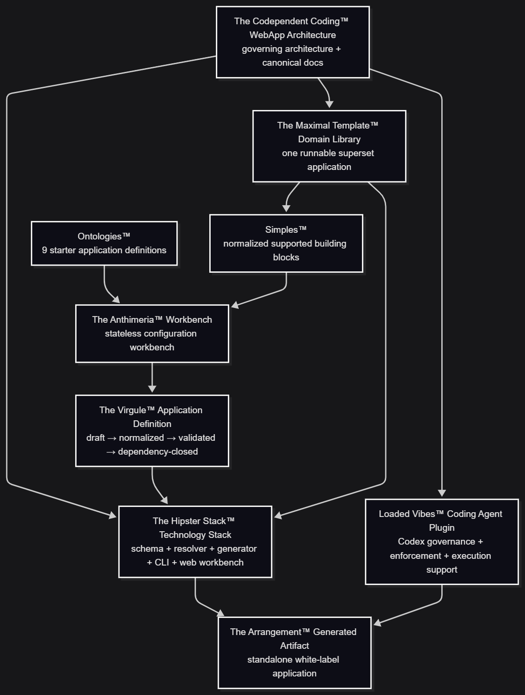

<div align="center">
  

  <br />
  <br />

  <h3>A SYSTEM FOR TURNING CODEBASES INTO CONTEXT AND CONTEXT INTO MEANING.</h3>

  <p>
    Who even still prompts?<br>
    Don't tell me you still write loops?<br>
    Loops are dead...<br>
    We build System Architecture!

        An invariant framework of contracts and gates
        that constrain the agent

  </p>

<p align="center">
  <a href="#the-typescripture-canonical-doctrine">TypeScripture™</a>
  ·
  <a href="#the-hipster-stack-technology-stack">Hipster Stack™</a>
  ·
  <a href="#the-anthimeria-workbench">Anthimeria™</a>
  ·
  <a href="#the-simples-normalized-blocks">Simples™</a>
  ·
  <a href="#the-maximal-template-domain-library">Maximal Template™</a>
  ·
  <a href="#the-ontology-normalized-defaults">Ontology™</a>
  ·
  <a href="#the-virgule-application-definition">Virgule™</a>
  ·
  <a href="#the-arrangement-generated-artifact">Arrangement™</a>
  ·
  <a href="#the-loaded-vibes-codex-plugin">Loaded Vibes™</a>
  ·
  <a href="#system-identity-and-product-topology">System Topology</a>
  ·
  <a href="#single-responsibility-principle">Architecture</a>
  ·
  <a href="#design-language">Design</a>
  ·
  <a href="#status">Status</a>
  ·
  <a href="#glossary">Glossary</a>
  ·
  <a href="#license">License</a>
</p>
<p align="center">
  
  
  
  
  
  
  
  
  
  
  
  
  
  
  
  
  
  
  
  
  
  
  
  
  
</p>

</div>

# THE CODEPENDENT CODING™ WEBAPP ARCHITECTURE

> [!IMPORTANT]
>
> I got tired of remembering systems.
> So I started building systems
> that remember.

---

The **Codependent Coding™ WebApp Architecture** is the umbrella system for defining how a modern, opinionated, multi-tenant TypeScript web application is structured, configured, generated, extended, and validated.

| Entity                                    | Definition                                                                                                                                                                                                                                                                               |
| ----------------------------------------- | ---------------------------------------------------------------------------------------------------------------------------------------------------------------------------------------------------------------------------------------------------------------------------------------- |
| **The Hipster Stack™ Technology Stack**   | The concrete technology stack together with the deterministic constitution and generation system, resolver, and CLI that transform a normalized Application Definition into a materialized software project.                                                                             |
| **The Maximal Template™ Domain Library**  | The single runnable superset application containing every supported implementation that the generation system may retain, remove, configure, or transform when producing a generated application.                                                                                        |
| **The Ontology™ Normalized Defaults**     | The canonical set of nine normalized starter Application Definitions that encode the supported default domain structures and configuration choices supplied to the shared resolver.                                                                                                      |
| **The Anthimeria™ Workbench**             | The stateless web configuration workbench operating over the shared Application Definition and resolver to construct, modify, resolve, and preview application configurations without becoming the persistent authority for application state.                                           |
| **The Simples™ Normalized Blocks**        | The maximal normalized library of supported reusable implementation blocks from which application capabilities are selected and constituted.                                                                                                                                             |
| **The BusinessLogic Blocks™ Workflows**   | The reusable domain and business-logic workflow layer that orchestrates application behavior through the appropriate server operations, helpers, contracts, types, and supporting implementation boundaries.                                                                             |
| **The PureUI Blocks™ Presentation Layer** | The reusable pure-presentation layer that composes UI primitives, component variants, semantic design tokens, and presentation structures without owning domain or business logic.                                                                                                       |
| **The Virgule™ Application Definition**   | The dependency-closed resolved Application Definition that serves as the authoritative machine-readable input for preview and materialization.                                                                                                                                           |
| **The Arrangement™ Generated Artifact**   | The standalone white-label application materialized by the generation system from a resolved Virgule™ Application Definition.                                                                                                                                                            |
| **The Loaded Vibes™ Codex Plugin**        | The Codex-oriented architecture-enforcement and software-operations layer comprising governance, agents, skills, instructions, prompts, validators, smoke tests, and developer-environment assets used to enforce and execute Codependent Coding doctrine.                               |
| **The Visual Vibes™ Design System**       | The concrete design system implementing the Codependent Coding visual language through semantic design tokens, presentation primitives, component variants, composition rules, and interface conventions for a dark industrial neo-brutalist technical aesthetic with restrained signal. |

# THE TYPESCRIPTURE™ CANONICAL DOCTRINE

| Entity                                    | Definition                                                                                                                                                                                                                                                                                           |
| ----------------------------------------- | ---------------------------------------------------------------------------------------------------------------------------------------------------------------------------------------------------------------------------------------------------------------------------------------------------- |
| **The TypeScripture™ Canonical Doctrine** | The canonical documentation authority for Codependent Coding™, organized as two paired bodies of doctrine: **The Book of Knowledge™**, which defines the meaning and conceptual authority of the system, and **The Book of Implementation™**, which defines its concrete software realization.       |
| **The Book of Knowledge™**                | The conceptual authority that defines **what exists, why it exists, what it means, how it relates, how it is classified, what constraints apply, what constitutes valid evidence, and what forms the system permits**.                                                                               |
| **The Book of Implementation™**           | The implementation authority that defines **how the concepts established by the Book of Knowledge become concrete architectures, contracts, interfaces, schemas, patterns, workflows, transactions, routes, authorization boundaries, infrastructure, runtime configurations, and executable code**. |

---

## THE HIPSTER STACK™ TECHNOLOGY STACK

    Constituted Not Composed.

### WHEN EPISTEMOLOGIES FAIL<br> THE STACK STILL GOVERNS

Finally, a technology stack with provenance that won't rust.
Nothing to borrow.
We've already checked.

#### The Technology Stack

- **Next.js**: eliminated a category of bullshit
- **React**: functions that return functions
- **TypeScript**: court-appointed supervisor
- **JavaScript**: historical inevitability
- **Tailwind**: tolerated because CSS exists
- **PostCSS**: fuck PostCSS
- **ShadCN UI**: pretty cool
- **Zod**: doesn't care about your interface
- **Prisma**: database operations without raw SQL everywhere
- **Postgres**: cool
- **JSONB**: also cool
- **Neon**: Serverless Postgres without the bullshit
- **Clerk**: stay in your lane and we're good
- **Stripe**: same
- **Redis**: no longer responsible for every known problem
- **Recharts**: recharted
- **ESLint**: go ESLint yourself then please run before commit
- **Prettier**: stop touching my shit also CI requires it
- **YAML**: disgusting but operational
- **pnpm**: dependency management slightly less deranged
- **Node**: respect
- **Deno**: tell Ryan we said hi
- **Bun**: fuck Bun
- **Vercel**: pretentious but useful
- **GitHub**: good enough
- **VS Code**: good-ish
- **NeoVim**: fuck NeoVim btw
- **Arch**: fuck Arch btw
- **PowerShell**: where the work happens
- **Redux Toolkit**: absolutely fucking not
- **Codex**: pretty fucking cool
- **ChatGPT**: management denies allegations of involvement

---

## THE ANTHIMERIA™ WORKBENCH

    No, Simples™ cannot be arranged "Hipster-Wise"
    They are simply a dynamic system arranged in a
    configuration that is currently "Hipster-ing"

The Anthimeria™ is the stateless web application used to configure an Ontology™ or build a custom Virgule™ Application Definition from supported Simples™ in The Maximal Template™.

It is an adapter over the same configuration semantics used by the CLI and portable config file.

> [!NOTE]
> Routes own URL and HTTP boundaries. Features orchestrate application capabilities. UI blocks render. Fetchers read persisted data. Actions own ordinary CRUD mutation boundaries. Schemas validate runtime input. Workflows constitute reusable application logic from server operations and helpers. Transactions preserve atomic database invariants. Authentication establishes identity. Authorization decides access. Integrations own provider mechanics. Webhooks own provider HTTP request lifecycles.

---

## THE SIMPLES™ NORMALIZED BLOCKS

    Process Over Nominalization

A **Simple™** is one of two normalized block families exposed from **The Maximal Template™ Domain Library**:

- **PureUI Block™**: which is a normalized reusable presentation arrangement
- **BusinessLogic Block™**: which is a normalized reusable domain Workflow arrangement

### THE PURE UI BLOCKS™ PRESENTATION LAYER

A **Pure UI Block™** is a pure reusable UI composition implemented in:

    components/blocks/

The canonical presentation arrangement is:

```text
PureUI Block™
      ↓
UI Block
      ↓
UI Primitives
      ↓
Primitive Variants
      ↓
Semantic Design Tokens
```

### THE BUSINESSLOGIC BLOCKS™ DOMAIN WORKFLOWS

A **BusinessLogic Block™** is a normalized Domain Workflow.

    lib/workflows/{domain}/*Workflow.ts

The canonical behavioral arrangement is:

```text
BusinessLogic Block™
      ↓
Domain Workflow
      ↓
Server Operations
+ Helpers
+ Types
+ Interfaces
+ Schemas
+ Integrations
+ Data Transport
+ Cache / Constants / Utils
```

---

## The Maximal Template™ Domain Library

> [!IMPORTANT]
> Introducing The Maximal Template™
> Maximum SaaS Per Token.
>
> Because productivity is dead.
> Long live product.
>
> Not the boring, spreadsheet-shaped “product.”
> We mean the good product. The dangerous product.
> The don’t-ask-what’s-in-it, just ship it product.
>
> Ship less code.
> Move more product.

**The Maximal Template** is a runnable, standalone, white-label superset application containing all supported implementation material that the generator can legally retain, remove, or transform.

#### Logic and server-operation

- fetchers
- actions
- workflows
- transaction helpers
- Prisma selects
- DTO mappers
- schemas
- types
- auth
- authz
- cache
- integration helpers
- webhook handlers
- constants
- utilities
- Prisma schema/domain models
- environment/config requirements

#### Public and product

- Landing page
- Pricing page
- Features / product-tour page
- Contact / demo-request page
- FAQ page
- Terms / privacy surfaces where required

#### Authentication and onboarding

- Sign in
- Sign up
- Workspace setup / onboarding
- Team invitation surfaces

#### Core application

- Main dashboard / overview
- Data list / table
- Detail / single-record view
- Kanban board
- Calendar / timeline
- Analytics / reports dashboard

#### Settings and management

- User profile settings
- Team / members
- Billing / subscriptions
- API / integrations settings

#### Utility and error

- 404
- 500 / fatal server error
- access denied / unauthorized
- maintenance / empty state where supported

#### Domain application surfaces

- CRM pipeline, contact directory, account profile, revenue analytics
- Project overview, backlog, timeline/Gantt, my tasks
- Support inbox, ticket workspace, knowledge base, SLA analytics
- Marketing campaign studio, audience manager, attribution analytics
- Invoice creator, invoice directory, expense upload/OCR
- Social calendar, composer, media library
- AI generation workspace, prompt playground, usage dashboard
- B2B shared dashboard, document vault, billing hub
- Admin record inspector, bulk user operations, audit logs

---

## THE ONTOLOGY™ NORMALIZED DEFAULTS

An **Ontology™** is a preset over the same normalized **Virgule Application Definition**.

### Ontology catalog

| Ontology                          | Primary surfaces                                       | Representative workflows                           | Common integrations                            |
| --------------------------------- | ------------------------------------------------------ | -------------------------------------------------- | ---------------------------------------------- |
| CRM / Pipeline Tracker            | pipeline, contacts, accounts, analytics                | deal stage, stalled deal, pipeline value, velocity | email, optional Stripe                         |
| Project Management / Task Tracker | projects, backlog, task detail, timeline, my tasks     | dependencies, health, milestone progress           | Blob, Cloudinary, email                        |
| Customer Support / Ticketing      | inbox, ticket workspace, knowledge base, SLA analytics | SLA, escalation, priority, assignment              | email, Blob, Cloudinary                        |
| Marketing Automation & Analytics  | campaigns, audiences, analytics                        | audience rules, sequences, attribution             | email, Cloudinary, analytics providers         |
| Invoicing & Expense Tracker       | invoices, invoice editor, expenses, billing            | totals, taxes, invoice status, expense rules       | Stripe, Blob, optional OCR                     |
| Social Media Scheduler            | calendar, composer, media                              | publish time, variants, publishing lifecycle       | Cloudinary, Blob, social providers             |
| AI-Powered Wrapper / Micro-SaaS   | generation, playground, usage                          | usage, credits, rate limits, model selection       | Hugging Face, optional model providers, Stripe |
| B2B Client Portal                 | shared dashboard, documents, billing                   | approvals, project state, document lifecycle       | Blob, Cloudinary, Stripe, email                |
| Internal Tools / Admin Portal     | records, users, audit                                  | audit classification, bulk operations              | provider admin surfaces as required            |

---

## THE VIRGULE™ APPLICATION DEFINITION

    The dependency-closed resolved
    Application Definition that serves
    as the authoritative machine-readable
    input for preview and materialization

The generated standalone application is a white-label project produced when **The Hipster Stack** consumes a dependency-closed **Virgule™ Application Definition** against **The Maximal Template**. It contains no runtime dependency on the generator and no requirement to remain connected to a hosted control plane.

The architecture is deliberately opinionated. It does not ask each project, developer, or coding agent to rediscover where reads, writes, workflows, policies, provider code, transactions, forms, presentation, routes, or webhooks belong. Responsibility is classified by what code does.

### Governing structural rule

```text
functional responsibility first
    ↓
minimum hierarchy necessary
    ↓
stable explicit boundaries
    ↓
deterministic configuration
    ↓
generated standalone application
```

---

## THE ARRANGEMENT™ GENERATED ARTIFACT

**The Arrangement** is the finished generated application:

- standalone
- white-label
- runnable
- understandable without generator internals
- architecture-conformant
- dependency-complete
- configured only with supported capabilities
- free of unused maximal-template surfaces intentionally removed by generation
- equipped with required local configuration/examples without secrets
- capable of normal source-control ownership after generation

### Generated artifact boundary

```text
generator metadata          generated application
------------------          ---------------------
ownership catalog     ─X→   no
pruning rules         ─X→   no
Anthimeria UI state   ─X→   no
CLI implementation    ─X→   no

app code               →    yes
application tests      →    yes
application docs       →    yes, when useful
app-local AGENTS/rules →    yes, when they govern the app
env examples           →    yes
CI/deployment config   →    yes, when supported
portable provenance    →    yes, when intentionally part of handoff
```

---

## THE LOADED VIBES™ CODEX PLUGIN

**Loaded Vibes** is the architecture-aware Codex plugin purpose-built to work with **Arrangements** and other repositories that explicitly adopt the **Codependent Coding WebApp Architecture**.

Its purpose is not to invent architecture. Its purpose is to make the architecture operational for coding agents.

### Plugin responsibility

The plugin should help an agent:

1. inspect the actual repository and local instructions;
2. identify the relevant architectural context before changes;
3. classify requested work into the correct layers;
4. preserve route/feature/presentation and server-operation boundaries;
5. respect auth/authz/tenancy/provider/security invariants;
6. plan bounded work;
7. implement without architecture drift;
8. validate architecture boundaries;
9. run proportional smoke/quality checks;
10. produce evidence-backed handoff.

---

# System Identity and Product Topology

<div align="center">
  

</div>

---

## Single Responsibility Principle

    A module should have one reason to change
    because it owns one architectural responsibility

Correct architecture-specific examples:

| Concern                                  | Canonical home                    | Core rule                                                                                                     |
| ---------------------------------------- | --------------------------------- | ------------------------------------------------------------------------------------------------------------- |
| URL / page route                         | `app/`                            | Own routing and route-level HTTP concerns only.                                                               |
| Provider webhook route                   | `app/api/{provider}/.../route.ts` | Own raw request lifecycle and provider acknowledgement.                                                       |
| Application orchestration                | `features/`                       | Combine application helpers and presentation.                                                                 |
| Browser-only orchestration               | `*.client.tsx`                    | Create only when browser state/interaction requires it.                                                       |
| Reusable UI composition                  | `components/blocks/`              | Pure presentation composed from primitives.                                                                   |
| Navigation                               | `components/nav/`                 | Reusable structural presentation.                                                                             |
| Page/application shell                   | `components/shells/`              | Reusable structural frame.                                                                                    |
| Raw UI primitive                         | `components/ui/`                  | Lowest-level presentation primitive.                                                                          |
| Persisted read                           | `lib/fetchers/`                   | Read-only.                                                                                                    |
| Ordinary persisted CRUD write            | `lib/actions/`                    | Mutation boundary; authn/authz/validation/scoping required as applicable.                                     |
| Prisma runtime/client                    | `lib/db/`                         | Database runtime infrastructure.                                                                              |
| Prisma select                            | `lib/db/selects/`                 | Precise persisted projection.                                                                                 |
| DTO mapper                               | `lib/db/dto/`                     | Persisted/domain shape → transport-safe application shape.                                                    |
| Atomic DB transaction                    | `lib/db/transactions/`            | Preserve multi-write database invariants.                                                                     |
| Authentication                           | `lib/auth/`                       | Clerk and app-facing identity/session helpers.                                                                |
| Authorization                            | `lib/authz/`                      | RBAC, ABAC, resource policy, tenant/resource decisions.                                                       |
| Provider behavior                        | `lib/integrations/{provider}/`    | Provider-specific client/mechanics/adapters.                                                                  |
| Reusable application-logic orchestration | `lib/workflows/{domain}/`         | Constitute named behavior from existing server operations and helpers; do not wrap trivial CRUD ceremonially. |
| Cache                                    | `lib/cache/`                      | Tags, lifetimes, invalidation and related infrastructure.                                                     |
| Constant                                 | `lib/constants/`                  | Stable shared constants.                                                                                      |
| Generic utility                          | `lib/utils/`                      | True generic utility only.                                                                                    |
| Prisma schema/migrations/seed            | `prisma/`                         | Prisma-owned lifecycle.                                                                                       |
| Runtime schemas                          | `schemas/`                        | Shared Zod validation at trust boundaries.                                                                    |
| Shared TS contracts                      | `types/`                          | Useful shared compile-time contracts.                                                                         |

## PR's

Tonight, somewhere between discussions of domain boundaries, contribution strategy, public reputation, and the quiet mechanics of open-source trust, a simple truth emerged:

    PR does not merely mean Pull Request.
    It also means Public Relations.

Every commit is communication.
Every issue comment is character.
Every README is theatre.

Every pull request is a handshake, a calling card, and a small declaration of professional taste.

One does not simply submit code.
One presents oneself.

---

## Design Language

The architecture documentation and public product surfaces share a deliberate visual language.

### Visual character

The target is:

- dark-mode only;
- black / near-black canvases;
- white / off-white primary text;
- restrained cyan-teal signal color;
- dense technical composition;
- strong borders;
- square or minimally rounded geometry;
- mechanical rather than bouncy motion;
- controlled glow;
- bold condensed/industrial display type;
- mono technical body/code treatment;
- desert/circuit visual motifs.

Avoid:

- pastel rainbow palettes;
- candy-color UI;
- excessive rounded cards;
- toy-like iconography;
- generic startup-gradient aesthetics;
- decorative motion that competes with information.

#### Brand color

The current product web contract uses approximately:

```text
canvas: #05030b / black
text:   white / off-white
signal: #2f7a8d
```

The signal color is for underlines, status accents, restrained glow, circuit detail, and hierarchy—not for flooding the interface.

#### Typography

The current direction uses:

- Archivo Black bold condensed display treatment for headings and wordmarks
- Copperplate bold treatment for key branding and product names
- JetBrains Mono for technical body/UI text
- Fira Code-style for code text

Build-safe fallbacks are required. Typography should be treated as a role contract, not as a reason to ship fragile font dependencies.

#### Theme and Semantic Design Tokens

The visual system is configured through semantic tokens rather than arbitrary per-component colors.

The Anthimeria Workbench may expose normalized theme controls that deterministically transform the supported `globals.css`/Tailwind theme layer.

Supported dimensions may include:

- palette
- background/foreground
- primary/secondary/accent
- destructive/success/warning/info
- border/input/ring
- chart colors
- signal/neon accents
- radius
- border width
- hard-shadow offset
- spacing/padding/margins within bounded supported scales
- motion/animation values
- heading/body/code font roles

---

## Status

> [!WARNING]
>
> I’ve seen things you language models wouldn’t believe…
> repos on fire off the main branch of GitHub…
> watched builds fail at the edge of the CI pipeline…
> all those moments… will be lost in time…
> like tokens outside the context window…
> time to deploy.

---

## License

Take this repo.
Clone it.
For it is open source.
Take this codebase.
Fork it.
For it is MIT.

    And as I walk through the
    valley of the shadow of deprecation.
    I shall fear no edits.
    In concurrency we promise.
    Async await.

---

## Glossary

| Term                   | Canonical meaning                                                                                                 |
| ---------------------- | ----------------------------------------------------------------------------------------------------------------- |
| **Route**              | URL/HTTP boundary.                                                                                                |
| **Feature**            | Application capability orchestration boundary.                                                                    |
| **Client Feature**     | Deliberate browser-only orchestration companion.                                                                  |
| **Block**              | Pure reusable UI composition.                                                                                     |
| **Primitive**          | Lowest-level UI component.                                                                                        |
| **Fetcher**            | Read-only persisted application data operation.                                                                   |
| **Action**             | Ordinary persisted CRUD mutation boundary.                                                                        |
| **Workflow**           | Named reusable orchestration boundary that constitutes application logic from existing server operations/helpers. |
| **Transaction Helper** | Atomic database persistence helper preserving multi-write invariants.                                             |
| **Select**             | Precise Prisma projection.                                                                                        |
| **DTO Mapper**         | Persistence/domain → transport-safe mapping function.                                                             |
| **Schema**             | Runtime boundary validation contract.                                                                             |
| **Authentication**     | Establishes verified identity/session.                                                                            |
| **Authorization**      | Decides permitted operation/resource/context.                                                                     |
| **Tenant**             | Architectural isolation concept.                                                                                  |
| **Organization**       | Canonical application-owned tenant entity in the default model.                                                   |
| **Membership**         | Contextual relationship connecting a User to an Organization and business authority.                              |
| **RLS**                | PostgreSQL row-level containment layer.                                                                           |
| **Integration**        | Provider-specific external-service mechanics.                                                                     |
| **Webhook**            | Provider HTTP request boundary and reconciliation lifecycle.                                                      |

---

Made in Nuevo Mexico | 2026 Ivan P. Roman | Digital Herencia
