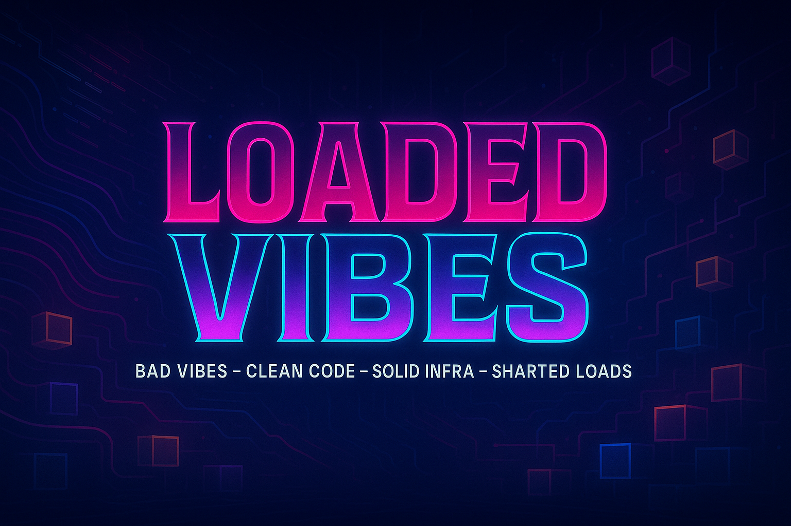

<div align="center">



<h1>Loaded Vibes Framework</h1>
<h3>Framework Development Workspace</h3>
<h4>Bad Vibes – Clean Code – Solid Infra – Sharded Loads</h4>

---

<div>

  
  
  
  
  
  
  
  
  
  

</div>

</div>

---

## 🌎 About This Workspace

This is the **framework development environment** for Loaded Vibes—an enterprise-grade Agentic TypeScript Web Development Framework. Use this workspace to author, test, and maintain the framework itself before shipping to end users.

> **⚠️ Maintainers Only:** This README covers framework authoring. For end-user documentation, see [`dist/README.md`](dist/README.md).

---

## 🛠️ Development Stack

- **Framework Core:** GenAIScript orchestrator, DevCycle engine, CLI tooling
- **Frontend:** Next.js 15 (App Router, RSC), React 19, Tailwind CSS 4, shadcn/ui
- **Data:** PostgreSQL (Neon), Prisma ORM, Redis cache layers
- **Auth & Security:** Clerk, JWT, ABAC/RBAC, Bad Vibes Firewall
- **Tooling:** Vitest, Playwright, ESLint, Prettier, GitHub Actions CI/CD
- **AI Integration:** GitHub Copilot Agent Mode, MCP servers, GenAIScript extension

---

## 📁 Directory Structure

| Scope               | Directory        | Purpose                                                                      |
| :------------------ | :--------------- | :--------------------------------------------------------------------------- |
| **Dev Environment** | Root workspace   | Framework authoring via `.vscode/`, `.github/`, `docs/`, `templates/`        |
| **Shipped Product** | `dist/`          | Artifacts delivered to users (`.github/`, `.vscode/`, `genaiscript/`, etc.)  |
| **User Project**    | `dist/src/`      | Generated application code (ignored by framework tooling)                    |

### Development Folders

```
├── .github/          # Copilot instructions & governance (DEV ONLY)
├── .vscode/          # Editor settings & extensions (DEV ONLY)
├── docs/             # PRD, Tech Requirements, architecture guides
├── spec/             # SPEC-ARCH, SPEC-CLI, SPEC-ENGINE, etc.
├── templates/        # Asset templates for generating shipped artifacts
├── decisions/        # Architecture Decision Records (ADRs)
└── app/              # Marketing site (loadedvibes.vercel.app)
```

### Shipped Artifacts (`dist/`)

```
dist/
├── .github/          # End-user agents, prompts, instructions, toolsets
├── .vscode/          # End-user VS Code settings & MCP config
├── genaiscript/      # Orchestrator engine & DevCycle manifest
├── cli/              # CLI commands (init, doctor, dashboard, devcycle)
├── docs/             # End-user documentation
└── src/              # Generated user project output
```

---

## 🧭 Spec-Driven Workflow

All framework development follows the **Analyze → Design → Implement → Validate → Reflect → Handoff** loop:

| Artifact                 | Purpose                                                    |
| ------------------------ | ---------------------------------------------------------- |
| `docs/PRD.md`            | Product requirements in EARS notation                      |
| `docs/TECH_REQUIREMENTS.md` | Technical architecture & implementation guidance        |
| `TODO.md`                | Trackable implementation plan with requirement citations   |
| `CHANGELOG.md`           | Execution evidence log with traceability                   |
| `spec/*.spec.md`         | Detailed specifications (ARCH, CLI, ENGINE, SECURITY, etc.)|

---

## 🚀 Framework Development Quickstart

### Prerequisites

- Node.js ≥ 20
- pnpm (package manager)
- VS Code with GenAIScript extension
- GitHub Copilot (Agent Mode enabled)

### Setup

```bash
# Clone the repository
git clone https://github.com/DigitalHerencia/LoadedVibes.git
cd LoadedVibes

# Install dependencies
pnpm install

# Run the marketing site locally
pnpm dev

# Validate framework manifests
pnpm run build
```

### Key Commands

| Command                          | Description                                      |
| -------------------------------- | ------------------------------------------------ |
| `pnpm dev`                       | Start Next.js dev server (marketing site)        |
| `pnpm build`                     | Build & validate all assets                      |
| `pnpm lint`                      | Run ESLint checks                                |
| `pnpm test`                      | Execute Vitest test suite                        |

---

## 🔧 DevCycle Governance

Loaded Vibes orchestrates development through **18 canonical DevCycles**:

| DevCycle        | Purpose                                    |
| --------------- | ------------------------------------------ |
| Initialization  | Bootstrap project structure                |
| Scaffolding     | Generate boilerplate & templates           |
| Configuration   | Set up environment & tooling               |
| Features        | Implement new functionality                |
| Testing         | Write & execute test suites                |
| Validation      | Verify requirements compliance             |
| Debug           | Diagnose & fix issues                      |
| Security        | Audit & harden the codebase                |
| Performance     | Optimize speed & resource usage            |
| Documentation   | Author guides & API docs                   |
| Observability   | Add logging, metrics, tracing              |
| Data            | Manage schemas & migrations                |
| Code Review     | Peer review & quality gates                |
| Deploy          | Ship to staging/production                 |
| CI/CD           | Automate build & release pipelines         |
| Updates         | Upgrade dependencies & framework           |
| Verification    | End-to-end validation                      |

Manifest: `dist/genaiscript/devcycles.config.json`

---

## 🔒 Security & Quality Gates

- **Bad Vibes Firewall:** Destructive operations require human approval with logged signatures
- **SHA256 Verification:** All releases are cryptographically signed
- **Secret Redaction:** Telemetry exports sanitize sensitive data
- **ABAC/RBAC:** Role-based access control throughout

---

## 🤖 CI Workflows

### Manifest Validation

Verifies all DevCycle entries resolve to valid instruction/toolset/prompt files.

- **Trigger:** Push/PR to `dist/genaiscript/devcycles.config.json`
- **Reference:** TECH_REQUIREMENTS §7, SPEC-ARTIFACTS §3

### Settings Guard

Ensures VS Code settings only reference development-layer assets (never `dist/**`).

- **Trigger:** Push/PR to `.vscode/settings.json`
- **Reference:** PRD §4.3, SPEC-ARCH §3

---

## 🤝 Contributing

See [`CONTRIBUTING.md`](CONTRIBUTING.md) for guidelines. All contributions must:

1. Follow the Spec-Driven Workflow
2. Include requirement citations (PRD/TECH clauses)
3. Update `TODO.md` and `CHANGELOG.md`
4. Pass CI validation

---

## 📚 Resources

| Resource                  | Location                                      |
| ------------------------- | --------------------------------------------- |
| **End-User Docs**         | [`dist/README.md`](dist/README.md)            |
| **PRD**                   | [`docs/PRD.md`](docs/PRD.md)                  |
| **Tech Requirements**     | [`docs/TECH_REQUIREMENTS.md`](docs/TECH_REQUIREMENTS.md) |
| **Security Policy**       | [`SECURITY.md`](SECURITY.md)                  |
| **Support**               | [`SUPPORT.md`](SUPPORT.md)                    |
| **Marketing Site**        | [loadedvibes.vercel.app](https://loadedvibes.vercel.app) |

---

> *"Bad Vibes, Clean Code, Solid Infra, Sharded Loads."*
