# Loaded Vibes Product Requirements Document (PRD)

## Document Control

| Field         | Value                                 |
| ------------- | ------------------------------------- |
| Product       | Loaded Vibes Framework                |
| Document Type | Product Requirements Document         |
| Status        | Draft (consolidated)                  |
| Last Updated  | 2025-11-24                            |
| Owners        | Framework Architecture & Tooling Team |

## 1. Executive Summary

Loaded Vibes delivers a spec-driven framework that keeps authoring assets, shipped artifacts, and runtime code permanently isolated while delighting builders with a retro, DevCycle-aware CLI. This PRD consolidates the former PRD, CLI blueprint, and engine experience requirements into a single source of truth for product behavior, ensuring every workflow—from `npx create-loaded-vibes` through the synthwave console—aligns with the Spec-Driven Workflow enforced by the custom agent.

```mermaid
graph TB
    subgraph Development["Development Environment (D:/LoadedVibes/)"]
        A1[".github/"]
        A2[".vscode/"]
        A3["docs/"]
        A4["spec/"]
        A5["templates/"]
        A6["decisions/"]
        A7[".agent_work/"]
        A8["app/, public/"]
    end

    subgraph Framework["Framework / Shipped Product (D:/LoadedVibes/dist/)"]
        B1["dist/.vscode/"]
        B2["dist/.github/"]
        B3["dist/docs/"]
        B4["dist/.genaiscript/"]
        B5["dist/genaiscript/"]
        B6["dist/cli/"]
        B7["dist/scripts/"]
        B8["dist/packages/"]
        B9["dist/.loaded-vibes/"]
        B10["dist/src/"]
    end

    subgraph EndUser["End-User Environment (<project-root>/)"]
        C1[".vscode/"]
        C2[".github/"]
        C3[".loaded-vibes/"]
        C4["src/"]
    end

    A5 -->|regenerate| B2
    A5 -->|regenerate| B3
    B1 -.->|mirror| C1
    B2 -.->|mirror| C2
    B9 -.->|mirror| C3
    B10 -.->|mirror| C4

    style Development fill:#2d2d2d,stroke:#ff6ec7,stroke-width:2px
    style Framework fill:#1a1a2e,stroke:#00d9ff,stroke-width:2px
    style EndUser fill:#16213e,stroke:#7dff7d,stroke-width:2px
```

## 2. Product Goals & Success Metrics

- **Separation of concerns:** Authoring stays inside `.github/`, `.vscode`, `docs`, `templates`; shipped assets live in `dist/**`; runtime code generates only under `dist/src/**` in end-user projects.
- **Deterministic DevCycles:** Every DevCycle run produces traceable plans, validation evidence, TODO/CHANGELOG hooks, and human approval checkpoints.
- **Delightful CLI experience:** The retro console presents DevCycle queues, logs, diagnostics, and ASCII-first feedback that mirror the orchestrator state.
- **Distribution clarity:** Releases publish via `create-loaded-vibes`, optional binaries, and mirrored `.loaded-vibes/` folders with signed artifacts.
- **Measured outcomes:** 100% of IDE automation references development files only; every DevCycle task cites a PRD/TechReq clause; CLI interactions log to `dist/.loaded-vibes/logs/*.ndjson` before shipping and mirror to `.loaded-vibes/logs/*.ndjson` inside user projects.

## 3. Personas & Journeys

| Persona                         | Needs                                                                                                          | Primary Touchpoints                                                  |
| ------------------------------- | -------------------------------------------------------------------------------------------------------------- | -------------------------------------------------------------------- |
| **Framework Maintainer**        | Author specs, prompts, instructions, and toolsets without touching shipped payloads.                           | VS Code workspace, docs/, templates/, custom agent.                  |
| **Automation Agent (@copilot)** | Execute DevCycles deterministically, surface checkpoints, update TODO/CHANGELOG, honor safety tooling.         | Copilot instructions, toolsets, GenAIScript orchestrator.            |
| **End-User Builder**            | Install via CLI, run retro dashboard, trigger DevCycles, view logs/diagnostics without needing authoring repo. | `create-loaded-vibes`, `.loaded-vibes/`, retro CLI, docs in release. |

## 4. Scope & Boundaries

### 4.1 Asset Taxonomy

1. **Development Environment (Maintainers Only):** Lives at `D:/LoadedVibes/` and contains workspace governance, specs, templates, automation helpers, and the marketing site. Nothing in this layer ships to end users. Allowed directories include `.github/`, `.vscode/`, `docs/`, `spec/`, `templates/`, `decisions/`, `.agent_work/`, and the Next.js site under `app/` + `public/`.
2. **Framework / Shipped Product:** Lives at `D:/LoadedVibes/dist/` and is the assembled framework delivered via the installer. It includes the end-user VS Code environment (`dist/.vscode/`), Copilot assets (`dist/.github/`), runtime engine + configs (`dist/genaiscript/`, `dist/.genaiscript/`), CLI (`dist/cli/`), bootstrappers + scripts (`dist/scripts/`), internal logs/state (`dist/.loaded-vibes/`), packages (`dist/packages/`), documentation (`dist/docs/`), shipped metadata (`dist/README.md`, `dist/VERSION`), and the code generation target (`dist/src/`).
3. **End-User Environment:** Created when a user runs `npx create-loaded-vibes`. It mirrors the shipped snapshot inside the user’s project root (`.loaded-vibes/`, `.github/`, `.vscode/`, `src/`) and becomes the execution surface for DevCycles.

### 4.2 Directory Responsibilities

- `docs/` holds PRD + Tech Requirements plus all engineering specs—no standalone spec files elsewhere.
- `.github/` stores dev-environment governance (Copilot instructions, issue templates, automation configs) for maintainers.
- `.vscode/` configures IDE behavior for maintainers only; the shipped VS Code profile lives in `dist/.vscode/`.
- `templates/` stores gold master content used to regenerate shipped artifacts.
- `.agent_work/` hosts maintainer-only automation outputs and bootstrapper logs.
- `dist/.github/**` defines the product-facing constitution (global instructions, agent manifests, prompts, toolsets).
- `dist/.loaded-vibes/**` captures the runtime logs, NDJSON telemetry, and manifest assets that ship to end users and later mirror into `.loaded-vibes/**` inside their projects.
- `dist/src/` is the framework’s code-generation target; once installed, its contents become `project-root/src/` for the end user.

### 4.3 Workspace vs. Release Enforcement

- WHEN authoring inside `D:/LoadedVibes`, THE SYSTEM SHALL block edits outside `.github/`, `.vscode/`, `docs/`, `spec/`, `templates/`, `decisions/`, `.agent_work/`, and the marketing site unless explicitly regenerating `dist/**`.
- WHEN regenerating the shipped framework, THE SYSTEM SHALL treat `dist/**` as immutable until a DevCycle approves mirrored changes and records evidence in TODO/CHANGELOG.
- WHEN generating runtime code, THE SYSTEM SHALL emit assets exclusively under `dist/src/**` (framework target) and, after installation, under `<project-root>/src/**` inside the consumer project.
- WHEN IDE tooling loads instructions or settings, THE SYSTEM SHALL source them from workspace `.github/` / `.vscode/`; shipped profiles reside only under `dist/.github/` and `dist/.vscode/`.
- WHEN referencing `.loaded-vibes/**`, THE SYSTEM SHALL clarify whether it is the shipped snapshot (`dist/.loaded-vibes/**`) or the user’s runtime mirror (`<project-root>/.loaded-vibes/**`).

## 5. Product Pillars & Requirements (EARS)

### 5.1 Distribution & Installation

- WHEN a user runs `npx create-loaded-vibes [project]`, THE SYSTEM SHALL download the latest signed release, mirror `dist/**` into `.loaded-vibes/`, install dependencies, and invoke `loaded-vibes init` for profile setup.
- WHEN the CLI runs preflight checks, THE SYSTEM SHALL verify Node ≥ 20, git, pnpm, VS Code, and the GenAIScript extension, surfacing actionable remediation steps.
- WHEN attaching to an existing repo, THE SYSTEM SHALL detect conflicts in `.github`, `.vscode`, or `dist/**` and offer Mirror, Merge, or Sandbox strategies while logging decisions to `.loaded-vibes/logs/install-YYYYMMDD.md`.

### 5.2 Retro Console Experience

- WHEN the user launches `loaded-vibes dashboard`, THE SYSTEM SHALL render the synthwave UI (ASCII masthead, gradient canvas, semantic colors) with panes for DevCycle queue, live logs, metrics, and TODO/CHANGELOG feeds.
- WHEN a DevCycle runs from the console, THE SYSTEM SHALL stream orchestrator events (plan, analyze, implement, validate, reflect) with pause/resume checkpoints and approval prompts for risky actions.
- WHEN notifications or errors occur, THE SYSTEM SHALL show animated toasts plus contextual remediation links to docs or `doctor` results.

### 5.3 DevCycle Governance

- WHEN a prompt triggers any DevCycle, THE SYSTEM SHALL load the associated instruction + toolset entry from `devcycles.config.json` before executing.
- WHEN DevCycles finish, THE SYSTEM SHALL append summarized work items to `TODO.md` and `CHANGELOG.md`, citing the originating requirement.
- WHEN a DevCycle needs additional guidance, THE SYSTEM SHALL offer a command palette entry (Ctrl+P) so users can rerun phases, view history, or open docs instantly.

### 5.4 Observability & Reporting

- WHEN troubleshooting (`loaded-vibes doctor`), THE SYSTEM SHALL scan prerequisites, MCP availability, file permissions, and drift between workspace + shipped manifest, offering optional auto-remediation.
- WHEN users request historical insight, THE SYSTEM SHALL provide searchable NDJSON logs filterable by DevCycle, timeframe, and severity, with export-to-Markdown support.
- WHEN release notes are generated, THE SYSTEM SHALL map CLI telemetry + changelog deltas directly to DevCycle identifiers for compliance.

### 5.5 Security & Risk Controls

- WHEN downloading releases, THE SYSTEM SHALL validate SHA256 signatures before extraction and block unsigned payloads.
- WHEN writing files, THE SYSTEM SHALL confine changes to `.loaded-vibes/**` unless the user explicitly approves copying templates into project roots.
- IF unsafe operations are requested, THEN THE SYSTEM SHALL raise a “Bad Vibes Firewall” warning describing impacted paths, required approvals, and rollback steps.

## 6. Success Metrics

- 100% of DevCycle runs include EARS-cited requirements within their execution logs.
- 0% of IDE settings reference shipped instructions; CI enforces guardrails.
- 100% of CLI installations log install strategy + checksum validation outcomes.
- CLI dashboard latency < 200 ms for log updates on modern hardware; `doctor` completes within 60 s for standard projects.

## 7. Dependencies & Assumptions

- Spec-Driven Workflow artifacts (PRD, Tech Requirements, TODO, CHANGELOG) stay current and live under `docs/`.
- GenAIScript orchestrator + bootstrapper referenced in Tech Requirements are available inside `dist/genaiscript/**`.
- ASCII artwork, gradients, and fonts referenced by the CLI ship within releases or are generated locally without external fetches.

## 8. Risks & Mitigations

- **Confused responsibilities:** Mitigated by explicit directory ownership table and README guidance (Section 9).
- **CLI drift from orchestrator:** Mitigated by shared `devcycles.config.json` manifest and CI checks verifying parity with Tech Requirements (Section 4).
- **Token/safety regressions:** Mitigated by human-in-loop checkpoints, Bad Vibes Firewall prompts, and adherence to Copilot agent guardrails.

## 9. Directory Ownership Matrix

| Directory                                                                   | Owner                | Purpose                                                                      |
| --------------------------------------------------------------------------- | -------------------- | ---------------------------------------------------------------------------- |
| **Development Environment (Maintainers Only)**                              |                      |                                                                              |
| `.github/`                                                                  | Maintainers          | Workspace Copilot instructions, GitHub templates, and automation configs.    |
| `.vscode/`                                                                  | Maintainers          | Maintainer VS Code + MCP profile (never ships).                              |
| `docs/`                                                                     | Maintainers          | Canonical PRD, Tech Requirements, reference material.                        |
| `spec/`                                                                     | Maintainers          | Architecture, engine, CLI, observability, security specs.                    |
| `templates/`                                                                | Maintainers          | Gold master assets used to regenerate shipped instructions/prompts/toolsets. |
| `decisions/`                                                                | Maintainers          | ADRs documenting governance decisions.                                       |
| `.agent_work/`                                                              | Maintainers          | Copilot automation scratch space, ignored in releases.                       |
| `app/`, `public/`, `.next/`                                                 | Maintainers          | Marketing/landing page sources (not shipped).                                |
| Workspace root configs (`*.json`, `*.md`, `.eslintrc`, `.prettierrc`, etc.) | Maintainers          | Development tooling configuration only.                                      |
| **Framework / Shipped Product (`dist/`)**                                   |                      |                                                                              |
| `dist/.vscode/`                                                             | Framework            | End-user VS Code settings + MCP config.                                      |
| `dist/.github/`                                                             | Framework            | End-user Copilot instructions, prompts, toolsets, agents.                    |
| `dist/docs/`                                                                | Framework            | End-user documentation bundle.                                               |
| `dist/.genaiscript/`                                                        | Framework            | Core engine config and manifest data.                                        |
| `dist/genaiscript/`                                                         | Framework            | Runtime engine scripts, tools, and phases.                                   |
| `dist/cli/`                                                                 | Framework            | CLI commands, workflows, security modules.                                   |
| `dist/scripts/`                                                             | Framework            | Bootstrappers and validation helpers shipped to users.                       |
| `dist/packages/`                                                            | Framework            | Shipped npm/binary packages.                                                 |
| `dist/.loaded-vibes/`                                                       | Framework            | Internal logs, state, telemetry mirrored into user projects.                 |
| `dist/src/`                                                                 | Framework → End User | Code-generation target that becomes `<project-root>/src/`.                   |
| `dist/README.md`, `dist/VERSION`                                            | Framework            | Root metadata for releases.                                                  |
| **End User Environment**                                                    |                      |                                                                              |
| `.loaded-vibes/`                                                            | End User + Runtime   | Logs, state, telemetry, manifest mirrored from `dist/.loaded-vibes/`.        |
| `.github/`, `.vscode/`                                                      | Framework            | Shipped automation inside user projects.                                     |
| `src/`                                                                      | End User             | Real application code generated after installation.                          |

## 10. Related Documents

- `docs/TECH_REQUIREMENTS.md` – Consolidated technical/architectural requirements, DevCycle manifest schema, engine automation, CLI implementation plan.
- `README.md` – Contributor quickstart and directory usage guidelines.
- `TODO.md` / `CHANGELOG.md` – Rolling execution evidence mandated by Spec-Driven Workflow.

This consolidated PRD supersedes prior standalone CLI and engine specs; future product changes MUST update this document before implementation.
