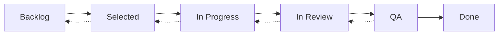

# GitHub Projects v2 Kanban Board Setup

This document provides the canonical setup instructions for the **Roadmap — ChatGPT Archive Utility** GitHub Projects v2 Kanban board and associated milestones.

## Overview

The project uses a phase-based delivery approach with 4 milestones and a Kanban board to track progress through the development pipeline.

## Automated Setup

Run the setup script to create milestones and assign issues automatically:

```bash
./scripts/setup-github-projects.sh
```

## Manual Setup Instructions
.\scripts\setup-github-projects.ps1
### 1. Create Milestones

Use the following `gh` CLI commands to create the four project milestones:

```bash
# Phase 1 — Foundation
gh api repos/DigitalHerencia/CodependentCoding/milestones \
  --method POST \
  --field title='Phase 1 — Foundation' \
  --field description='Foundation tasks: DB, contracts, CI, basic features (T001, T002, T003, T004, T005, T017)' \
  --field due_on='2025-10-01T23:59:59Z' \
  --field state='open'

# Phase 2 — Core Features  
gh api repos/DigitalHerencia/CodependentCoding/milestones \
  --method POST \
  --field title='Phase 2 — Core Features' \
  --field description='Core functionality: webhooks, actions, CRUD, search, admin (T006, T007, T008, T009, T010, T011)' \
  --field due_on='2025-11-01T23:59:59Z' \
  --field state='open'

# Phase 3 — UX & Analytics
gh api repos/DigitalHerencia/CodependentCoding/milestones \
  --method POST \
  --field title='Phase 3 — UX & Analytics' \
  --field description='User experience and analytics: viewer, tagging, timeline, dev tools (T012, T013, T014, T015)' \
  --field due_on='2025-12-01T23:59:59Z' \
  --field state='open'

# Phase 4 — Polish & Docs
gh api repos/DigitalHerencia/CodependentCoding/milestones \
  --method POST \
  --field title='Phase 4 — Polish & Docs' \
  --field description='Final polish: deployment preparation and documentation (T018, T019)' \
  --field due_on='2025-12-31T23:59:59Z' \
  --field state='open'
```

### 2. Milestone-to-Task Mapping

| Milestone | Tasks | Issues |
|-----------|-------|---------|
| **Phase 1 — Foundation** | T001, T002, T003, T004, T005, T017 | #1, #2, #3, #4, #5, #16 |
| **Phase 2 — Core Features** | T006, T007, T008, T009, T010, T011 | #6, #7, #8, #9, #10, #11 |
1. A workflow was added at `.github\workflows\setup-projects.yml` that will create milestones and T001-T019 issues and assign them to milestones.
2. To run the automation from the GitHub UI: go to the repository → Actions → `Setup GitHub Project (milestones & issues)` → Run workflow (workflow_dispatch).
3. Alternatively, run the workflow via the REST API or `gh` CLI once you have permissions.
| **Phase 3 — UX & Analytics** | T012, T013, T014, T015 | #12, #13, #14, #15 |
| **Phase 4 — Polish & Docs** | T018, T019 | #17, #18 |

### 3. Create GitHub Projects v2 Board

Since `gh` CLI has limited Projects v2 support, create the board via the GitHub web UI:

1. **Navigate to Projects**: https://github.com/DigitalHerencia/CodependentCoding/projects
2. **Create New Project**: Click "New project"
3. **Choose Template**: Select "Board" template
4. **Configure Project**:
   - **Name**: `Roadmap — ChatGPT Archive Utility`
   - **Description**: `Kanban for phased delivery`
   - **Visibility**: Private (or as per organization policy)

### 4. Configure Board Columns

Create the following columns in order:

1. **Backlog** - Default status for new issues
2. **Selected** - Issues assigned to current milestone/sprint  
3. **In progress** - Actively being worked on
4. **In review** - Pull request submitted, under review
5. **QA** - Ready for quality assurance testing
6. **Done** - Completed and merged

### 5. Configure Automations

Go to **Project Settings → Automation** and add these rules:

#### Rule 1: PR Linked to Issue → In Review
- **Trigger**: Pull request opened
- **Condition**: Pull request links to an issue in this project
- **Action**: Move linked issue to "In review"

#### Rule 2: Issue/PR Closed → Done  
- **Trigger**: Issue closed OR Pull request merged
- **Condition**: Issue/PR is in this project
- **Action**: Move to "Done"

#### Rule 3: Milestone Assigned → Selected
- **Trigger**: Issue updated
- **Condition**: Milestone is added to issue
- **Action**: Move to "Selected"

> **Note**: Automation configuration may vary based on GitHub's current Projects v2 interface. Configure equivalent rules using the available automation options.

### 6. Add Issues to Board

Add all T001-T019 issues (#1-#18) to the project board:

1. In the project board, click "Add item"
2. Search for and select issues #1 through #18
3. Issues will automatically move to "Selected" when milestones are assigned

## Project Structure

### Phase Definitions

- **Phase 1 — Foundation**: Core infrastructure, database setup, contracts, CI/CD
- **Phase 2 — Core Features**: Main application functionality, user flows, admin features  
- **Phase 3 — UX & Analytics**: User experience improvements, analytics, advanced features
- **Phase 4 — Polish & Docs**: Final deployment preparation, documentation, polish

### Workflow



## Maintenance

### Adding New Issues

1. Create issue with appropriate labels
2. Assign to relevant milestone (if applicable)
3. Issue will auto-move to "Selected" via automation
4. Add to project board if not automatically added

### Milestone Updates

To modify milestones, use:

```bash
gh api repos/DigitalHerencia/CodependentCoding/milestones/{milestone_number} \
  --method PATCH \
  --field title='New Title' \
  --field description='New description' \
  --field due_on='2025-12-31T23:59:59Z'
```

### Issue Assignment

Assign issues to milestones:

```bash
gh api repos/DigitalHerencia/CodependentCoding/issues/{issue_number} \
  --method PATCH \
  --field milestone={milestone_number}
```

## Troubleshooting

### GitHub CLI Authentication

If you encounter authentication issues:

```bash
gh auth login
gh auth status
```

### Projects v2 API Limitations

GitHub's Projects v2 API is still evolving. Some operations may require web UI interaction:

- Creating project boards
- Configuring complex automations  
- Advanced field configurations

### Permission Issues

Ensure you have:
- **Admin** or **Write** access to the repository
- **Admin** access to the organization (for organization-level projects)

## References

- [GitHub Projects v2 Documentation](https://docs.github.com/en/issues/planning-and-tracking-with-projects)
- [GitHub CLI Projects Extension](https://cli.github.com/manual/gh_project)
- [Projects v2 API Reference](https://docs.github.com/en/graphql/reference/objects#projectv2)

---

**Last Updated**: September 2025  
**Script Location**: `./scripts/setup-github-projects.sh`